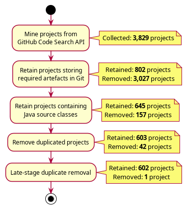
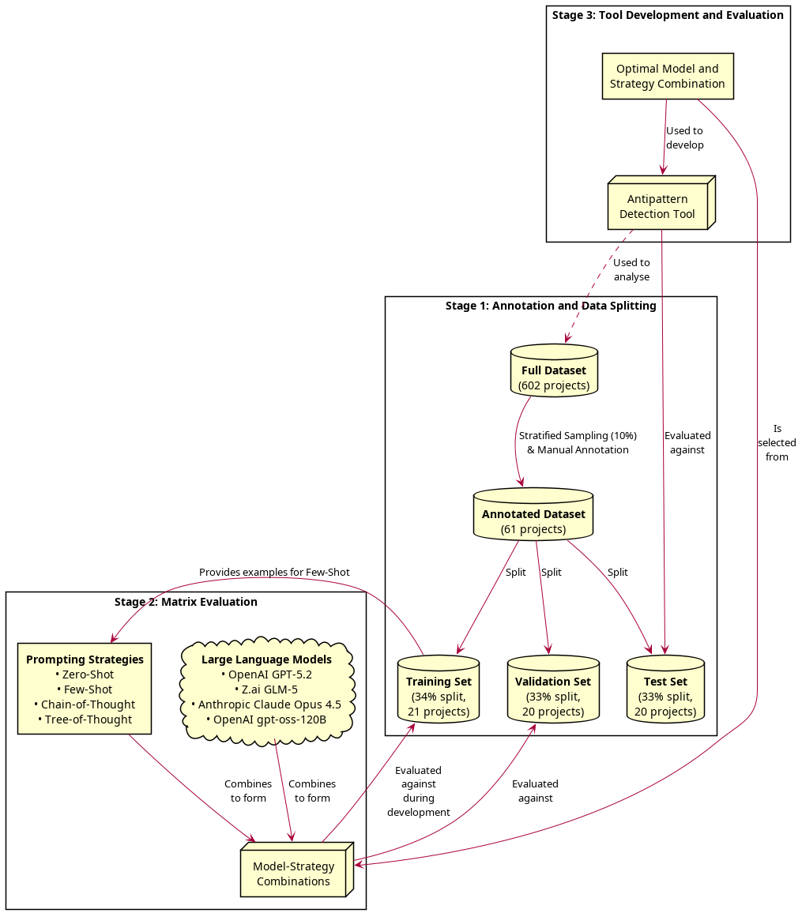
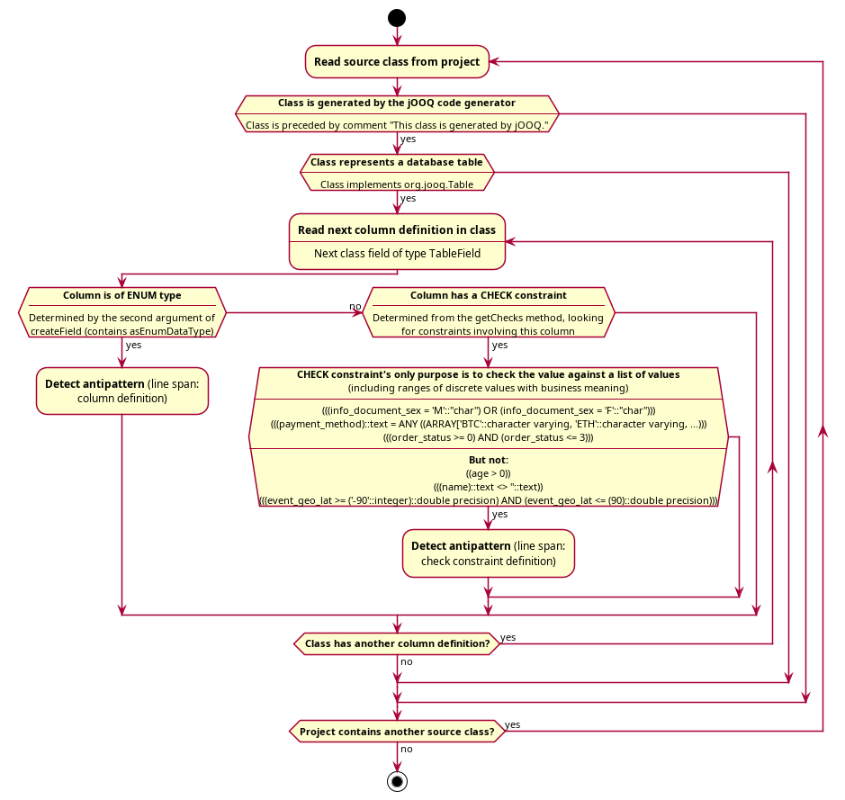
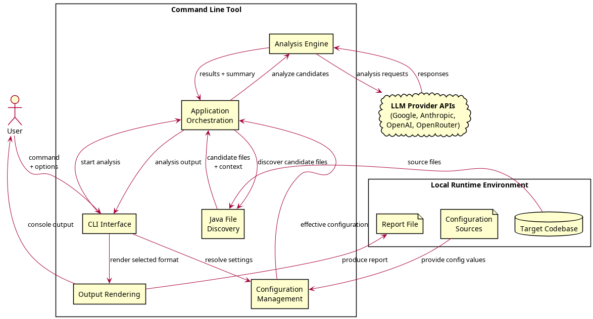
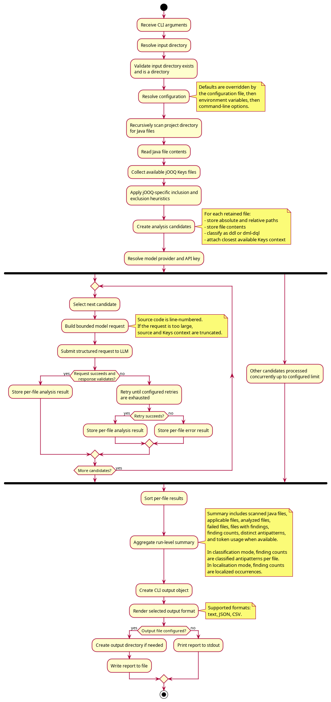

<style>
section::after {
  content: attr(data-marpit-pagination) ' / 18';
}

section.centered {
  display: flex;
  flex-direction: column;
  justify-content: center;
  text-align: center;
}
</style>

# Detection of SQL Antipatterns in jOOQ Database Access Code Using Large Language Models

&nbsp;
**Kristo Isberg**
Supervisor: Erki Eessaar, PhD
&nbsp;
Tallinn University of Technology
25.05.2026

<!--
Honorable Chair, members of the committee, supervisor, and guests. I'm Kristo and my Master's thesis topic is Detection of SQL Antipatterns in jOOQ Database Access Code Using LLMs. My supervisor is Erki Eessaar, who sadly couldn't attend this defense today.

I will first briefly go over the background to explain the relevance of my topic, and then my research goals, and how I fulfilled them along with results.
-->

---

# Background

- **SQL Antipattern**
  - "... a commonly occurring solution to a problem that generates decidedly negative consequences" (Brown et al., 1998)
  - Can affect performance, maintainability, portability, and data integrity
  - **Example:** _Implicit Columns_ (using `SELECT *`) can waste >25% of runtime/energy
- **jOOQ:** Popular Java library for type-safe, DSL-based database access

<!--
SQL antipatterns are common but counterproductive solutions to database design and querying. While they may seem effective initially, they eventually lead to significant issues in performance, maintainability, portability, and data integrity.

My research focuses specifically on jOOQ, a popular Java library that integrates SQL directly into Java as a type-safe, domain-specific language. It is widely used in complex industrial projects where traditional ORMs fall short.
-->

---

# SQL Antipatterns in Java: literature review

- Prevalent in Java projects
  - _Implicit Columns_ affects every 50th query
  - Remain unfixed longer than traditional code smells
  - Authors suspect lack of awareness or low priority
- Two tools capable of statically detecting SQL antipatterns in Java
  - None capable of detecting from jOOQ DSL

<!--
Previous research confirms that SQL antipatterns are highly prevalent in Java projects and have a quantifiable negative impact. For instance, fixing just one common pattern—Implicit Columns—can improve runtime and energy efficiency by over 25%. Despite this, these patterns often remain unfixed because developers either lack awareness or lack the proper tools to detect them.

This brings us to the core problem: current static analysis tools in Java are designed to find antipatterns in plain SQL strings. However, because jOOQ builds queries dynamically through its own DSL, these existing tools are completely unable to see them.
-->

---

# Research Goals

- Development of an LLM-based static analysis tool for detecting SQL antipatterns
- Studying the prevalence and occurrence patterns of SQL antipatterns in jOOQ

<!--
The main goal of this thesis is filling this gap by developing an LLM-based static analysis tool for detecting SQL antipatterns. Another, secondary goal is to study the prevalence and occurrence patterns of existing projects using jOOQ to see how it compares to projects using plain SQL. This can be useful both to developers looking to avoid indulging in antipatterns, as well as the maintainers of jOOQ to take into consideration.
-->

---

# Research Questions

- **RQ1:** How do different LLMs compare in identifying SQL antipatterns in Java code that uses jOOQ for database access?
- **RQ2:** How do different prompting strategies affect the detection performance of LLMs in identifying SQL antipatterns in Java code that uses jOOQ for database access?
- **RQ3:** How accurately can the developed LLM-based tool detect SQL antipatterns in Java code that uses jOOQ for database access?
- **RQ4:** What patterns can be observed in the occurrence of SQL antipatterns in Java code that uses jOOQ for database access?
- **RQ5:** Which jOOQ API methods are most frequently associated with query antipattern occurrences?

<!--
To help us in our goals, we formulated five research questions regarding LLMs' capability of detecting SQL antipatterns; the impact different prompting strategies have on it; the detection performance of our tool; and occurrence patterns of SQL antipatterns in existing software.
-->

---

# Dataset Creation

- Used GitHub API to mine for projects using jOOQ
  - Filtered out non-Java projects, duplicates, etc
  - Gathered **602** applicable projects
- Annotated a subset of 10% projects
  - Stratified sampling using head-tail breaks to preserve size distribution
  - 4 large, 10 medium, and 47 small projects
  - **1,562** total antipattern occurrences identified manually

<!--
As there weren't any datasets available on SQL antipatterns in jOOQ, we had to create one ourselves. First, we mined for software projects depending on jOOQ using the GitHub search API. Then we applied several filters to exclude projects, which were not suitable for our dataset, such as projects written languages that weren't Java, and duplicates. In the end, we were left with 602 projects.

We selected a subset of ten percent of projects to annotate as our ground truth. As the dataset was heavily skewed towards small projects, we wanted to preserve the original size distribution in that subset. We used head-tail breaks to divide projects into three size categories, and sampled ten percent of each.

And then we carefully annotated the subset.
-->

---

# Dataset Creation

- Internal consistency measured using Cohen's Kappa
  - Re-annotated 10% of files after one month
    $$ \kappa = \frac{p_o - p_e}{1 - p_e} = 0.834 $$
  - Result: _Almost perfect agreement_
- **61** projects split into training/validation/test sets
  - Split ratio of 34/33/33
  - Monte Carlo optimisation to achieve an optimal split

<!--
We employed a single-annotator setup, but verified the internal consistency of the annotations. After a wash-out period of one month, we re-annotated 10 percent of the files. We compared the two sets of annotations and calculated their Cohen's kappa, which showed that the annotations were in almost perfect agreement, and were highly consistent.

We then divided the annotations into training, validation, and test sets using Monte Carlo optimization to ensure a balanced distribution of antipatterns across all subsets.
-->

---

# Analysis of LLMs and prompting strategies

- Models:
  - OpenAI GPT-5.2 — reasoning model
  - Anthropic Claude 4.5 Opus — non-reasoning model
  - Z.ai GLM-5 — open model
  - OpenAI gpt-oss-120B — medium-sized open model
- Prompting strategies:
  - Zero-Shot — baseline
  - Few-Shot — providing examples
  - Chain-of-Thought (CoT) — "Think step by step."
  - Tree-of-Thought (ToT) — simulating a conversation between three experts

<!--
We included a set of four diverse models in our analysis. GPT-5.2, which was the state-of-the-art reasoning model at the time. GLM-5, which was the best-performing open source model. Claude Opus 4.5, which we used as a non-reasoning model by disabling its reasoning capabilities. And gpt-oss-120B, which was one of the top-performing medium-sized models at the time.

And we evaluated four different prompting strategies. Zero-shot, which we treated as the baseline. Few-shot, where we provided it with example input and output combinations. Chain-of-thought, where we asked the model to think step-by-step. And tree-of-thought, where the model was asked to simulate the interactions between 3 subject matter experts.
-->

---

# Analysis of LLMs and prompting strategies

- Designed prompts for each strategy, evaluating against training set
- Evaluated performance of each LLM & strategy combination on validation set
  $$ P = \frac{\text{TP}}{\text{TP} + \text{FP}}, \quad R = \frac{\text{TP}}{\text{TP} + \text{FN}}, \quad F_1 = 2 \cdot \frac{P \cdot R}{P + R} $$
- Localisation task: True Positive only if model found the correct lines according to Intersection over Union
  $$ \text{IoU} = \frac{|S_p \cap S_g|}{|S_p \cup S_g|} \ge 0.5 $$

<!--
We iteratively designed prompts for each prompting strategy, measuring their performance against the training set. Once we were happy with the prompts, we evaluated their performance with each LLM on the validation set, and calculated their F1-scores, while also keeping track of their costs, runtimes, and general stability.

Here lies one novelty in our study. So far, all studies regarding LLMs' performance in detecting code smells have treated it as a classification task, just indicating which code smells the provided source file contains. We treat is as a localisation task, so the model also needs to locate exact line ranges where the antipatterns reside. A prediction is only considered a true positive, if the prediction lines up by at least 50 percent with the ground truth.
-->

---

<style scoped>
h1 {
  font-size: 1.25em;
}

th, td {
  font-size: 0.8em;
}
</style>

# RQ1: How do different LLMs compare in identifying SQL antipatterns in Java code that uses jOOQ for database access?

- All large models demonstrated similar performance
  - Varying costs and runtimes
  - GPT-5.2 was more paranoid than others
- gpt-oss-120B suffered from anomalies degrading performance

| Model                               | Precision |  Recall  | F1-Score | Cost (USD) | Runtime (s) |
| :---------------------------------- | :-------: | :------: | :------: | :--------: | :---------: |
| GPT-5.2 (reasoning)                 |   0.85    | **0.92** | **0.88** |   26.16    |    2,423    |
| GLM-5 (reasoning)                   | **0.88**  |   0.89   | **0.88** |   11.11    |    5,775    |
| **Claude Opus 4.5 (non-reasoning)** | **0.88**  |   0.89   | **0.88** |   29.97    |   **367**   |
| gpt-oss-120B (reasoning)            |   0.83    |   0.87   |   0.83   |  **1.49**  |    2,808    |

<!--
To compare the models' baseline detection performance, we compared their performance using the zero-shot strategy.

The results were surprisingly close. All three of the large models demonstrated very similar performance regarding F1-score. The only difference was that GPT-5.2 was more paranoid than the others, meaning that it had fewer false negatives than the others, at an expense of more false positives.

Costs and runtimes varied a lot. GLM-5 was much cheaper than the other two large models, but was a lot slower and suffered from stability issues, requiring many retried requests.

And gpt-oss did fine for the most part, but really fell apart for antipatterns, which were more difficult to detect, and had a tendency to produce garbled responses, and this was especially evident for files, which required more reasoning.
-->

---

<style scoped>
h1 {
  font-size: 1.25em;
}

th, td {
  font-size: 0.8em;
}
</style>

# RQ2: How do different prompting strategies affect the detection performance of LLMs in identifying SQL antipatterns in Java code that uses jOOQ for database access?

- 2% performance gains to non-reasoning model from CoT and ToT
- Up to 1% gains to open models from Few-Shot
- Gains for one model generally balanced by degradations for other models
- Large increases to cost and runtime

| Strategy         | Avg F1-Score Increase | Avg Cost Increase | Avg Runtime Increase |
| :--------------- | :-------------------: | :---------------: | :------------------: |
| Few-Shot         |         0.6%          |        31%        |         -1%          |
| Chain-of-Thought |         -0.3%         |        23%        |         90%          |
| Tree-of-Thought  |         0.1%          |        88%        |         638%         |

<!--
When testing the other prompting strategies, the gains over the baseline were modest at best. For example, the prompting strategies, which were used to elicit additional reasoning, increased the performance of the non-reasoning model, but slightly decreased the performance of reasoning models. And this came at a large cost - the analysis prices and runtimes increased significantly.

The Few-Shot prompting strategy slightly benefitted the open models, GLM-5 and gpt-oss, but increased analysis costs as well.
-->

---

# Development and evaluation of the analysis tool

- **Stack:** Bun (build tool & runtime), TypeScript, and Vercel AI SDK
- **Architecture:** Self-contained CLI tool
- **Pre-processing:**
  - Irrelevant files skipped based on black- and whitelists
  - **Line number prefixing:** Helps LLMs maintain spatial awareness and prevent miscalculations
- Zero-Shot prompt, default model Claude Opus 4.5 (non-reasoning)
- **Output:** Human-readable text summaries + machine-readable JSON/CSV

<!--
We implemented the learnings from our experiments as a full-featured analysis tool. We built it using the Bun JavaScript toolchain, with TypeScript as the programming language and Vercel's AI SDK as a means to communicate with different LLM providers. It is a built as a self-contained executable command-line tool, so it can be used without installing any external runtime like Java or Node, and does not require a graphical environment.

While a lot of the weight lies on the model and the prompts, the tool does a number of things to help them in their job. For example, it skips the analysis on files, which are considered to be irrelevant based on their paths or contents, to avoid performing unnecessary model calls. It also prepends each line with its line number, which is necessary for LLMs to identify correct line numbers, as they struggled with it otherwise.

And that tool is capable of outputting both human-readable analysis results with explanations and refactoring suggestions, as well as machine readable formats for future integrations and evaluation purposes.
-->

---

<style scoped>
h1 {
  font-size: 1.17em;
}
</style>

# RQ3: How accurately can the developed LLM-based tool detect SQL antipatterns in Java code that uses jOOQ for database access?

&nbsp;
$$ P = 0.88, \quad R = 0.88, \quad F_1 = 0.88 $$
&nbsp;

- **Best performers:** _Implicit Columns_ $(F_1 = 0.96)$ and _31 Flavors_ $(F_1 = 0.97)$
  - **Why?** Self-contained; specific detection patterns
- **Worst performers:** _Keyless Entry_ $(F_1 = 0.69)$, _Poor Man's Search Engine_ $(F_1 = 0.68)$, and _Fear of the Unknown_ $(F_1 = 0.48)$
  - **Why?** Require cross-file context; imprecise localisation behaviour

<!--
We evaluated the tool against the test set using the Claude Opus 4.5 model without reasoning, which gave us the best balance between performance and runtime, at the expense of cost, and the performance we saw from the tool was good, achieving a weighted average F1-score of 0.88. We didn't have much comparison data available, but this was better than any tool we compared it to. We noticed an overarching pattern that the tool performed the best on antipatterns, which were relatively self-contained, and struggled a bit more with ones that required an understanding of context from multiple files.
-->

---

<style scoped>
h1 {
  font-size: 1.25em;
}
</style>

# RQ4: What patterns can be observed in the occurrence of SQL antipatterns in Java code that uses jOOQ for database access?

- 15,931 total antipatterns occurrences found in 602 projects, 26.5 per project
- **Dominant core:** "Implicit Columns" and "ID Required"
  - Contained by 89% and 87% of projects
- **Missing constraints:** "Keyless Entry" and "Beware of the Unknown"
  - Presence of one indicates the presence of other
- **Infection path:** Rarer SQL antipatterns are (weak) indicators of more common ones

<!--
Using the developed tool and the Claude Opus 4.5 model without reasoning, we analysed the complete set of 602 projects, and we found nearly 16 thousand antipattern occurrences, which equates to 26 and a half occurrences per project.

We found that "Implicit Columns" and "ID Required" were the most common antipatterns, found in nearly 90 percent of projects each. The "ID Required" antipattern indicates bad practices in creating primary keys for tables, such as non-descriptive names or redundant keys. These antipatterns also showed a very high degree of co-occurrence, and their numbers in projects grew proportionally.

There was also a visible pattern showing that the "Keyless Entry" and "Beware of the Unknown" pattern were correlated, indicating that projects, which are missing foreign key constraints, are also more likely to be missing NOT NULL constraints, and vice versa.

What we also found is that less common antipatterns are indicators that more common antipatterns are also present nearby. For example, if a file contains the "Poor Man's Search Engine" antipattern, there is a 54 percent percent chance that the "Implicit Columns" antipattern is present in the same file, and a 95 percent percent chance it's present in the project.
-->

---

<style scoped>
h1 {
  font-size: 1.5em;
}
</style>

# RQ5: Which jOOQ API methods are most frequently associated with query antipattern occurrences?

### Implicit Columns

- More than 75% associated with shorthands for fetching jOOQ records
  - e.g., `DSL.selectFrom(TABLE)`, `DSL.select().from(TABLE)`
- Only 12.9% explicitly show the intent to fetch all columns
  - e.g., `DSL.asterisk()`, `TABLE.fields()`

<!--
We further investigated the occurrences of two query antipatterns to see, which methods they were associated with.

We found that over three quarters of all "Implicit Columns" occurrences were associated with jOOQ DSL methods, which are used to fetch records, which contain all columns of the underlying table. Although the jOOQ documentation discourages using such methods to avoid fetching redundant data, these are some of the simplest ways to fetch data using jOOQ, and are clearly still very popular. Perhaps there should be some other measures taken to discourage their use even further.

Methods, where the intent of fetching all columns was more explicit, were much less frequently associated, at about thirteen percent of all occurrences.
-->

---

<style scoped>
h1 {
  font-size: 1.5em;
}
</style>

# RQ5: Which jOOQ API methods are most frequently associated with query antipattern occurrences?

### Poor Man's Search Engine

- More than 60% explicitly use `LIKE` and `ILIKE` operators with wildcards
  - `FIELD.like("%" + value + "%")`, `FIELD.ilike`
- Wildcards are added implicitly in 28% of cases
  - `FIELD.contains(value)`, `FIELD.containsIgnoreCase`

<!--
In case of the "Poor Man's Search Engine", the results were somewhat the opposite. This antipattern indicates that the database is being used as a full-text search engine, which does not scale well. The majority of sixty percent of cases of the antipattern were associated with methods, which required the users to explicitly use preceding and succeeding wildcards for full-text search. And only less than thirty percent were associated with methods, where the wildcards were added implicitly.
-->

---

# Highlights & Contributions

- Created an internally consistent ground truth
- First to treat LLM-based antipattern detection as a localisation task
- Developed the first available tool for detecting SQL antipatterns in jOOQ
- Performed a large-scale analysis of jOOQ projects

<!--
So, what were the main contributions of this thesis? We created an internally consistent dataset about SQL antipattern occurrences in jOOQ projects. We analysed the current state of LLM performance in detecting SQL antipatterns, and we were the first to tackle a similar task as a localisation task. We developed the first available tool for detecting SQL antipatterns in jOOQ, and we used the tool to perform a large-scale analysis of jOOQ projects regarding the occurrence patterns of SQL antipatterns.
-->

---

# Thank you for listening!

<!--
Thank you for listening.
-->

---

<style scoped>
section::after {
  display: none;
}
</style>

# 1) Why have you not applied Abstract Syntax Trees at your SQL code classification method? How do you see the combination of LLMs and ASTs in SQL antipattern detection?

<!--
The first question was regarding us choosing an LLM-based approach, rather than using AST based methods.

A more comprehensive comparison between an LLM and AST based approach was initially planned as part of the thesis, but resulting from feedback at the Master's seminar, we limited the scope to just one approach. The main reasons for choosing LLMs were a much smaller implementation complexity to achieve a similar result, and better generalisability and extensibility due to LLMs semantic understanding of codebases.
-->

---

<style scoped>
p {
  margin-top: 100px;
}

section::after {
  display: none;
}
</style>

```java
void fetchData() {
    return dslContext.select(TABLE.asterisk()).from(TABLE).fetchOne();
}
```

```java
void fetchData(boolean fetchOther) {
    List<Field> columns = getColumns(fetchOther);
    return dslContext.select(columns).from(TABLE)
        .innerJoin(OTHER).on(OTHER.ID.eq(TABLE.OTHER_ID))
        .fetchOne();
}

void getColumns(boolean fetchOther) {
  List<Field> columns = new ArrayList<>();
  columns.add(TABLE.ID);
  if (fetchOther) columns.add(OTHER.asterisk());
  return columns;
}
```

<!--
For example, the "Implicit Columns" antipattern should be detected when all of a table's columns are fetched implicitly. To detect this correctly, the tool needs to know both the list of columns selected, and the context of the query, because in some cases, fetching them all is fine, such as in EXISTS or COUNT subqueries. But due to the dynamic nature of jOOQ's DSL, the list of columns could be directly embedded into the query, it could be in an intermediate variable, in a separate method, could be constructed conditionally, and so on. Using a purely AST-based solution, this would require complex intra- and inter-procedural data flow analysis.
-->

---

<style scoped>
section::after {
  display: none;
}
</style>

```java
public class UsersTable extends TableImpl<UsersTableRecord> {

  public final TableField<UsersTableRecord, String> GENDER =
    createField(DSL.name("gender"), SQLDataType.VARCHAR(255), this, "");

  @Override
  public List<Check<UsersTableRecord>> getChecks() {
    return Arrays.asList(
      Internal.createCheck(
        this,
        DSL.name("users_table_gender_check"),
        "(((gender)::text = ANY ((ARRAY['MALE'::character varying, 'FEMALE'::...])))",
        true
      )
    );
  }
}
```

<!--
And the second example is regarding the "31 Flavors" antipattern, which should be detected when a CHECK constraint is used to limit a column's values to a predetermined list.

The issue is that jOOQ doesn't represent CHECK constraints as parts of the Java code, but as fragments of SQL. This means that the SQL fragments would need to be parsed and analysed separately, essentially requiring the analysis of two separate programming languages.

And CHECK constraints can also be written in all sorts of different weird ways, so the complexities pile up fast.

So I do believe that using LLMs is the correct approach for detecting SQL antipatterns, especially if this approach is extended to antipatterns, which require analysing relationships between different queries. Yet, I believe ASTs could be used as a pre-processing step to provide the model with more granular context to save tokens, as well as more extensive context when combined with an approach like RAG.
-->

---

<style scoped>
section::after {
  display: none;
}
</style>

# 2) Why some existing no-LLM detection solutions like DBDeo were not included in related work comparison?

<!--
The next question addresses why some existing tools, prominently DbDeo, were left out of our performance evaluations despite being mentioned in our related work.
-->

---

<style scoped>
section::after {
  display: none;
}

ol { 
  list-style-type: upper-alpha; 
}
</style>

- Comparison only included static analysis methods
  1. Performance of other methods was usually not evaluated
  2. Evaluation was under vastly different conditions
- First party evaluation of DbDeo did not provide any comparison points
- Third party study only provided precision: $P = \frac{\text{TP}}{\text{TP} + \text{FP}}$

| Antipattern     | This study | DbDeo | SQLCheck |
| :-------------- | :--------: | :---: | :------: |
| 31 Flavors      |    0.97    | 0.52  |   0.99   |
| Rounding Errors |    1.00    | 0.99  |   0.98   |
| ...             |    ...     |  ...  |   ...    |
| **Total**       |    0.88    | 0.83  |   0.95   |

<!--
Firstly, we only compared our performance to other static source code analysers, and excluded other methods, such as database query log analysers. One reason was that such comparisons would be performed under vastly different conditions, and would evaluate entirely different things, so they would not carry much value. And the other reason is that most other studies did not publish performance metrics at all.

DbDeo belongs somewhat into the latter camp. Our studies only had an overlap of one detected antipattern. And they evaluated their tool on such a small dataset that their tool didn't find any occurrences of that antipattern, so we didn't have any comparison points.

A third party study analysed a later version of DbDeo and the overlap had grown to two antipatterns, and they also used a larger dataset. However, they didn't use a ground truth, but rather classified the detections manually as true and false positives. This means that they don't have recall and F1-score measures available, but only the precision.

As seen in the table, our precision is highly competitive with theirs. However, taken out of context, these numbers could be misleading. For example, SQLCheck achieved a slightly lower precision for "Rounding Errors" here than DbDeo. However, it is known that SQLCheck achieved this at recall about 30 percent higher than DbDeo's. It just isn't quantifiable in absolute numbers, and the numbers only show the full picture when each tool is evaluated on the exact same dataset.
-->

---

<style scoped>
section::after {
  display: none;
}
</style>

# 3) How would you overcome the size limitation of your original dataset? (Some antipattern types were not included in train-validate-test sets due to their rarity)

<!--
And the third question was regarding our manually annotated dataset. Despite a very laborious annotation process up front, we didn't gather enough samples of certain rare antipatterns to evaluate them, forcing us to exclude them.

This was a very refreshing point of view, as so far, I had been mostly thinking about how to make the dataset more robust, more consistent, more objective, which would all require even more time. So this made me consider that maybe the previously mentioned studies, which didn't have a ground truth, and didn't count false negatives, were onto something.
-->

---

<style scoped>
section::after {
  display: none;
}

ol { 
  list-style-type: upper-alpha; 
}
</style>

1. Complete shift of methodology
   - Skip up-front annotation of ground truth
   - Manually classify tool's detections as TP/FP
   - Cache classifications, reuse for future iterations
   - Replace recall ratio with absolute number of detections

$$ P = \frac{\text{TP}}{\text{TP} + \text{FP}}, \quad R = \text{TP} $$

2. Augment data with synthetic samples

<!--
If we ditched the ground truth and manually classified the tool's detections as true and false positives afterwards, we would save a huge amount of up front effort. As we wouldn't need to worry about statistical validity of the ground truth, we could come up with detection strategies for less common antipatterns, and evaluate them when they detect something. The evaluations would initially be more time consuming, but by caching and reusing the classifications, the effort would shrink with each evaluation.

Using the true and false positive classifications, we could still calculate the precision of the tool, but rather than using a recall ratio, we would need to compare the raw number of true positive detections. In the context of this study, this is nearly as good to evaluate, which model, prompting strategy, or detection strategy finds the most true positives, but it wouldn't be as useful in a broader context.

Another option, which would preserve the human-annotated dataset without spending an enormous amount of time annotating or sacrificing statistical validity of some antipatterns, would be to produce synthetic data, but this produces its own challenges, as it is hard to predict all variations of an antipattern, which could be out there.
-->

---

<style scoped>
section::after {
  display: none;
}
</style>

# Thank you for listening!

---

<!-- _class: centered -->

<style scoped>
section::after {
  display: none;
}
</style>



---

<!-- _class: centered -->

<style scoped>
section::after {
  display: none;
}
</style>



---

<!-- _class: centered -->

<style scoped>
section::after {
  display: none;
}
</style>



---

<!-- _class: centered -->

<style scoped>
section::after {
  display: none;
}
</style>



---

<!-- _class: centered -->

<style scoped>
section::after {
  display: none;
}

img {transform: translateY(33.1%)
}
</style>



---

<!-- _class: centered -->

<style scoped>
section::after {
  display: none;
}

img {transform: translateY(-3.5%)
}
</style>


---

<!-- _class: centered -->

<style scoped>
section::after {
  display: none;
}

img {transform: translateY(-33.7%)
}
</style>


---

<style scoped>
section::after {
  display: none;
}

h1 {
  font-size: 1.17em;
}

th, td {
  font-size: 0.8em;
}
</style>

# RQ3: How accurately can the developed LLM-based tool detect SQL antipatterns in Java code that uses jOOQ for database access?

| Antipattern              | Precision |  Recall  | F1-Score |
| :----------------------- | :-------: | :------: | :------: |
| Implicit Columns         |   0.98    |   0.94   |   0.96   |
| ID Required              |   0.87    |   0.85   |   0.86   |
| Keyless Entry            |   0.54    |   0.97   |   0.69   |
| Fear of the Unknown      |   0.44    |   0.53   |   0.48   |
| 31 Flavors               |   0.97    |   0.97   |   0.97   |
| Poor Man's Search Engine |   0.76    |   0.62   |   0.68   |
| Rounding Errors          |   1.00    |   0.81   |   0.90   |
| **Total**                | **0.88**  | **0.88** | **0.88** |
